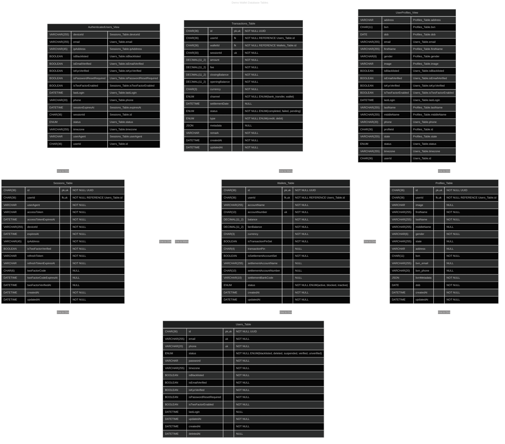

# WalletApi

Demo Credit is a mobile lending app that requires wallet functionality. This is needed as borrowers need a wallet to receive the loans they have been granted and also send the money for repayments.

## Getting Started

Follow these steps to set up and start developing with WalletApi.

### 1. Clone the Repository

```sh
git clone https://github.com/factman/WalletApi.git
cd WalletApi
```

### 2. Install Dependencies

Make sure you have [Node.js](https://nodejs.org/) and [npm](https://www.npmjs.com/) installed. Then run:

```sh
npm install
```

### 3. Recommended VSCode Extensions

For the best development experience, install these recommended VSCode extensions:

- [ESLint](https://marketplace.visualstudio.com/items?itemName=dbaeumer.vscode-eslint) – Linting and code quality
- [Prettier](https://marketplace.visualstudio.com/items?itemName=esbenp.prettier-vscode) – Code formatting
- [Mermaid Chart](https://marketplace.visualstudio.com/items?itemName=mermaidchart.vscode-mermaid-chart) – Provide support for mermaid file preview within VSCode, This is required to view the ER Diagram
- [Vitest](https://marketplace.visualstudio.com/items?itemName=vitest.explorer) – Provide vitest runner adapter within VSCode

> Open the Extensions sidebar in VSCode and search `@recommended` to see all the recommended extensions for this project.

### 4. Useful npm Scripts

The `package.json` includes several scripts to help with development:

| Script             | Description                                       |
| ------------------ | ------------------------------------------------- |
| `npm run dev`      | Start the app in development mode with hot reload |
| `npm run build`    | Compile TypeScript source to JavaScript           |
| `npm start`        | Run the compiled app in production mode           |
| `npm run test`     | Run the test suite using Vitest                   |
| `npm run coverage` | Run the test suite and generate coverage report   |
| `npm run lint`     | Lint the codebase with ESLint                     |
| `npm run format`   | Format code using Prettier                        |
| `npm run migrate`  | Run database migrations via Knex                  |
| `npm run seed`     | Seed the database with initial data               |

Refer to the `package.json` for more details and additional scripts.

## Database Entity Relationship Diagram

<details>
  <summary>Preview ER Diagram (Mermaid)</summary>

> Click the link below to view the mermaid file <br /> [View Mermaid File](./ER_Diagram.mermaid)



</details>

<br/>

<details>
  <summary>Preview ER Diagram (PNG)</summary>

> Click on the image to preview the diagram in a Live Editor

[![Database Entity Relationship Diagram](https://mermaid.ink/img/pako:eNrdWVtP4zgU_itWnqbaUjWlFOhboRktu7SgUlhpVQm5idtaTeyu48B0EP99j51eco_RDKvR8tJgf9_xyfG5-Dhvlss9YvWtk5OTGZNU-qSPhiTg6C_s-0SiIZZ4jkOCpnjuk3DGXM4WdNmfMQR_ckUCIHhYrOMB9TQCiX0kRUQSoCcsqJawY6o_nzJyzX0u-uh1RSXAtRZEDCleChzEyMeQiPBZL4_ejuTr3weTL6e9BqIe2qybKFqjmTW-m6Lx4-0teny8Gc6sI_ppMNGEztlZA5EAUz9NKMS2G2iz4oyUQ53x4wiFEssoTK6uhr_MfeyufRpK4jWRR8CY6iGMwg1hnnp8IYIuqHqK2P65UaAI2uAwfOXCq9NXvZukAfmudC7GXt3d3TqDMaLh1VG9WqyjDPa0U7EW_efWNcbe715tQkIiJ-SfiAoD1vSVf8Wu5MJhyi3KCMPB1JnejBzk41De8iVlClgGijYeBmMMZJ00VxAz4G7TY2AC9D5j8cMDCUPK2Q979wEdQazceGiRY0ycr87EGV87yXBqUa_I3ZSQwZIwWe1vCLsu6D_la8LqLJGAOt82sMfhQJp4s0deqEtuajeYGArtgky6GXgegENzN6tx571BBFmA3FWVRYqgdRbRmsPmyr0615Bgqzw5BUxJr2Xs37QabhwBVTH1XhgD9smJnUr5faDeQT6THMGPIse8e8EXFOrJrxU7NMDLor1JefWCilCOcUBMQkDlLlNsQD3PJ3t0CRJedakqkDCRqGpbhTCEj6FU5LW23UDzF2ayEsCe48JcYb12jIurch73x8PdWAFGRGJwPFzhnsjj85-W6A3cPOOuxm4eH8N-LS-PNwxyOo9YlW_GLtA-QqNgDm5XepoaOtc3o8EteM1zBzYa-5i5xAjrU8KuKvGxARrIjYQgzN3WJ3-BWQg5EXLTPWUPpDI7dyE7p_AFznkUDcLgnB1AhR3EhimXng7GLK8k0g92zxPiHSiPsDTrCrN1SbGpOvkqK7yQJpr73F2r8y1l8VDj08MsHS7GUZbY7E8ItY-G2UHCq36bChmp1y2UovdTV1gQYxh5OFC-YgRdELMAdX0eUra8-kBMc-iTaimGYa291V1hxoifb9TAy591-C6IaO6MXuyqx9AYFtfFqrBwebDZdYELqHPqV7WC8I6NnAi53ZC8AOiNqFTN5JymFdSFL0hUvdJjZwAN-qfXvVRIFsSW_VtFYI4w2-5XK-Wm47yAHfMHkVzBZlFXqRmv90TJazK4y_qN9Lm0tZ-puVSYWcmw1mMmfUhmscOUSeueyiPJObNePk1PzZq092l6Yu5j_X5aTCHK-Coga8wcpvaOIKnNYbz6iihN0mMlGUQrl-zKMvoeetnCknBM5vkX9cozUVK5eNDkBinJ2g_X3RhklDpMVZXIzP57maJeFsW6vGf6x3yFr5VgckBQmMMRviSFJJqh9Gm_hfPRnGmPMgQYLGlYMkAY_DkZKdeYZhY6TNW1lBlePF7VKmcIevh_l_cK0lRawifmqMwtQsbe-xmzS4UM-Tj3Q9nxkA82sXidErJ-4dVeUmQYevi_TokfTG35vGKQkiqImWuGPNdqWktBPau_wH5ImlZABLg-_G_phDazfLzlEWRrRfXwUgCrGc_o7zj7CbFW0t5B3AazvzkPrL764tO0BI-Wq4P4-IS4-55zgOiccK2aDKtvdzvdUy3F6r9Z36x-r9tq273LTrt3etk973UvmtYWYOeXrc7Zee_01L6w271e5_y9aX3X69otu925sM8u2u1zu3thXzYtdU7mYhR_2tJfuN7_BYOi-uU?type=png)](https://mermaid.live/edit#pako:eNrdWVtP4zgU_itWnqbaUjWlFOhboRktu7SgUlhpVQm5idtaTeyu48B0EP99j51eco_RDKvR8tJgf9_xyfG5-Dhvlss9YvWtk5OTGZNU-qSPhiTg6C_s-0SiIZZ4jkOCpnjuk3DGXM4WdNmfMQR_ckUCIHhYrOMB9TQCiX0kRUQSoCcsqJawY6o_nzJyzX0u-uh1RSXAtRZEDCleChzEyMeQiPBZL4_ejuTr3weTL6e9BqIe2qybKFqjmTW-m6Lx4-0teny8Gc6sI_ppMNGEztlZA5EAUz9NKMS2G2iz4oyUQ53x4wiFEssoTK6uhr_MfeyufRpK4jWRR8CY6iGMwg1hnnp8IYIuqHqK2P65UaAI2uAwfOXCq9NXvZukAfmudC7GXt3d3TqDMaLh1VG9WqyjDPa0U7EW_efWNcbe715tQkIiJ-SfiAoD1vSVf8Wu5MJhyi3KCMPB1JnejBzk41De8iVlClgGijYeBmMMZJ00VxAz4G7TY2AC9D5j8cMDCUPK2Q979wEdQazceGiRY0ycr87EGV87yXBqUa_I3ZSQwZIwWe1vCLsu6D_la8LqLJGAOt82sMfhQJp4s0deqEtuajeYGArtgky6GXgegENzN6tx571BBFmA3FWVRYqgdRbRmsPmyr0615Bgqzw5BUxJr2Xs37QabhwBVTH1XhgD9smJnUr5faDeQT6THMGPIse8e8EXFOrJrxU7NMDLor1JefWCilCOcUBMQkDlLlNsQD3PJ3t0CRJedakqkDCRqGpbhTCEj6FU5LW23UDzF2ayEsCe48JcYb12jIurch73x8PdWAFGRGJwPFzhnsjj85-W6A3cPOOuxm4eH8N-LS-PNwxyOo9YlW_GLtA-QqNgDm5XepoaOtc3o8EteM1zBzYa-5i5xAjrU8KuKvGxARrIjYQgzN3WJ3-BWQg5EXLTPWUPpDI7dyE7p_AFznkUDcLgnB1AhR3EhimXng7GLK8k0g92zxPiHSiPsDTrCrN1SbGpOvkqK7yQJpr73F2r8y1l8VDj08MsHS7GUZbY7E8ItY-G2UHCq36bChmp1y2UovdTV1gQYxh5OFC-YgRdELMAdX0eUra8-kBMc-iTaimGYa291V1hxoifb9TAy591-C6IaO6MXuyqx9AYFtfFqrBwebDZdYELqHPqV7WC8I6NnAi53ZC8AOiNqFTN5JymFdSFL0hUvdJjZwAN-qfXvVRIFsSW_VtFYI4w2-5XK-Wm47yAHfMHkVzBZlFXqRmv90TJazK4y_qN9Lm0tZ-puVSYWcmw1mMmfUhmscOUSeueyiPJObNePk1PzZq092l6Yu5j_X5aTCHK-Coga8wcpvaOIKnNYbz6iihN0mMlGUQrl-zKMvoeetnCknBM5vkX9cozUVK5eNDkBinJ2g_X3RhklDpMVZXIzP57maJeFsW6vGf6x3yFr5VgckBQmMMRviSFJJqh9Gm_hfPRnGmPMgQYLGlYMkAY_DkZKdeYZhY6TNW1lBlePF7VKmcIevh_l_cK0lRawifmqMwtQsbe-xmzS4UM-Tj3Q9nxkA82sXidErJ-4dVeUmQYevi_TokfTG35vGKQkiqImWuGPNdqWktBPau_wH5ImlZABLg-_G_phDazfLzlEWRrRfXwUgCrGc_o7zj7CbFW0t5B3AazvzkPrL764tO0BI-Wq4P4-IS4-55zgOiccK2aDKtvdzvdUy3F6r9Z36x-r9tq273LTrt3etk973UvmtYWYOeXrc7Zee_01L6w271e5_y9aX3X69otu925sM8u2u1zu3thXzYtdU7mYhR_2tJfuN7_BYOi-uU)

</details>

### Tables

- **users**
  Stores user account information such as email, phone, password, status, and verification flags.

- **profiles**
  Contains personal profile details for users, including name, address, BVN, date of birth, gender, and profile image. Each profile is linked to a user via `userId`.

- **wallets**
  Represents user wallets, holding balances, account numbers, currency, and settlement account details. Each wallet is linked to a user via `userId`.

- **sessions**
  Tracks user sessions for authentication, including tokens, device info, IP address, and two-factor verification status. Each session is linked to a user via `userId`.

- **transactions**
  Records all wallet transactions, including amounts, balances, fees, type (credit/debit), status, and references to the session, user, and wallet involved.

### Views

- **authenticatedUsers**
  A view that joins user and session data to provide a combined representation of an authenticated user, including session and user status fields.

- **usersProfiles**
  A view that joins user and profile data to provide a comprehensive user profile, combining account and personal information.

### Relationships

- Each **profile** references a **user** via `userId`.
- Each **wallet** references a **user** via `userId`.
- Each **session** references a **user** via `userId`.
- Each **transaction** references a **user** (`userId`) and a **wallet** (`walletId`).

#### Entity Relationship Summary

- **users** ←→ **profiles**: One-to-one (each user has one profile)
- **users** ←→ **wallets**: One-to-one (each user has one wallet)
- **users** ←→ **sessions**: One-to-one (each user has one sessions)
- **users** ←→ **transactions**: One-to-many (each user can have multiple transactions)
- **wallets** ←→ **transactions**: One-to-many (each wallet can have multiple transactions)

## Folder Structure

This project follows a **Modular Feature Isolation** pattern to organize its codebase for scalability, maintainability, and clear separation of concerns.

<details>
  <summary>View Folder Structure</summary>

```bash
WalletApi/
├── @types                # Custom TypeScript type definitions for the project
├── coverage              # Code coverage reports generated by test tools
├── db/
│   ├── migrations        # Database migration scripts for schema changes
│   └── seeds             # Seed files to populate the database with initial/test data
├── dist                  # Compiled JavaScript output from the TypeScript source
├── src/
│   ├── configs           # Application configuration files (e.g., environment, database)
│   ├── features/         # Modular feature folders, each encapsulating a domain feature
│   │   └── featureName/
│   │       ├── controller.ts   # Handles HTTP requests and responses for the feature
│   │       ├── service.ts      # Business logic and core operations for the feature
│   │       ├── router.ts       # Express routes/endpoints for the feature
│   │       ├── validation.ts   # Input validation schemas and logic
│   │       ├── utilities.ts    # Helper functions specific to the feature
│   │       └── middlewares.ts  # Feature-specific middleware functions
│   ├── helpers           # General-purpose utility functions used across the app
│   ├── middlewares       # Global Express middleware (e.g., error handling, auth)
│   ├── models            # Database models and ORM definitions
│   ├── repositories      # Data access logic and database queries
│   ├── router            # Main application router combining all feature routes
│   ├── validations       # Shared validation logic and schemas
│   └── index.ts          # Entry point for the application source code
├── .env                  # Environment variable definitions
├── ER_Diagram.mermaid    # Mermaid file describing the database entity relationship diagram
├── knexfile.ts           # Knex.js configuration for database migrations and seeds
├── package.json          # Project metadata and dependencies
├── README.md             # Project documentation
├── vitest.config.js      # Configuration for Vitest testing framework
└── ...                   # Other files and folders (e.g., tsconfig.json, .gitignore, etc...)
```

</details>

### Modular Feature Isolation Pattern

- **Global Scope:**
  All files and folders directly under `src/` (such as `configs`, `helpers`, `middlewares`, `models`, `repositories`, `router`, `validations`, and `index.ts`) are considered global.

  - **Import Rules:**
    - Files in the global scope can import from anywhere within the app, including other global files and feature modules.
    - They provide shared utilities, configurations, and infrastructure used across all features.

- **Feature Scope:**
  Each subfolder under `src/features/` represents a self-contained feature module (e.g., `src/features/transactions/`).
  - **Import Rules:**
    - Files within a feature module can only import from the global scope.
    - Feature modules **cannot import from or be imported by other feature modules**—they are strictly isolated from each other.
    - This ensures that each feature is decoupled and has no hidden dependencies on other features.

### Advantages of This Pattern

- **Easy API Versioning:**
  Features can be versioned independently, making it straightforward to introduce new API versions or deprecate old ones without affecting unrelated parts of the codebase.

- **Painless Feature Migration:**
  Since each feature is isolated, migrating a feature to a standalone microservice or another project is simple and low-risk.

- **Feature Decoupling:**
  Strict isolation prevents cross-feature dependencies, reducing the risk of unintended side effects and making the codebase easier to reason about.

- **Improved Maintainability:**
  Developers can work on features in parallel with minimal risk of merge conflicts or accidental coupling.

- **Scalability:**
  As the application grows, new features can be added as isolated modules without increasing complexity elsewhere.

- **Testability:**
  Features can be tested independently, with clear boundaries and minimal mocking required.

This structure encourages clean architecture, enforces clear boundaries, and supports long-term growth and refactoring of the codebase.

## Features and Endpoints

Each feature is implemented as an isolated module under `src/features/`, following the Modular Feature Isolation pattern.

---

### **Authentication**

Handles user registration, login, logout, password management, email verification, and session management.

| Endpoint                              | Method | Description                         | Auth Required |
| ------------------------------------- | ------ | ----------------------------------- | ------------- |
| `/api/auth/signup`                    | POST   | Register a new user                 | No            |
| `/api/auth/login`                     | POST   | User login                          | No            |
| `/api/auth/logout`                    | DELETE | Logout user and invalidate session  | Yes           |
| `/api/auth/refresh-token`             | POST   | Refresh authentication tokens       | No            |
| `/api/auth/forgot-password`           | POST   | Initiate password reset             | No            |
| `/api/auth/reset-password`            | POST   | Reset password using token          | No            |
| `/api/auth/verify-email`              | PATCH  | Verify user email address           | No            |
| `/api/auth/resend-email-verification` | PATCH  | Resend email verification OTP       | No            |
| `/api/auth/verify-forgot-password`    | PATCH  | Verify password reset code          | No            |
| `/api/auth/initiate-auth`             | POST   | Initiate authentication (e.g., 2FA) | No            |
| `/api/auth/initiate-bvn-verification` | POST   | Start BVN verification              | Yes           |
| `/api/auth/verify-bvn`                | PUT    | Complete BVN verification           | Yes           |

---

### Users

The Users feature provides endpoints for managing user accounts, including retrieving user details, changing passwords, and deleting accounts. All endpoints require authentication and a valid user ID parameter.

| Endpoint                         | Method | Description               | Auth Required | Request Validation      |
| -------------------------------- | ------ | ------------------------- | ------------- | ----------------------- |
| `/api/users/:id`                 | GET    | Get user details by ID    | Yes           | `id` param (UUID)       |
| `/api/users/:id/change-password` | PATCH  | Change user password      | Yes           | `id` param, body schema |
| `/api/users/:id/delete-account`  | DELETE | Delete user account by ID | Yes           | `id` param (UUID)       |

---

### Wallets Feature

The Wallets feature provides endpoints for managing user wallets, including retrieving wallet details, adding settlement accounts, setting transaction PINs, performing name enquiries, and funding wallets. All endpoints require authentication and appropriate request validation.

| Endpoint                                   | Method | Description                      | Auth Required | Request Validation      |
| ------------------------------------------ | ------ | -------------------------------- | ------------- | ----------------------- |
| `/api/wallets/:id`                         | GET    | Get wallet details by wallet ID  | Yes           | `id` param (UUID)       |
| `/api/wallets/:id/settlement-account`      | POST   | Add or update settlement account | Yes           | `id` param, body schema |
| `/api/wallets/:id/transaction-pin`         | POST   | Create or update transaction PIN | Yes           | `id` param, body schema |
| `/api/wallets/name-enquiry/:accountNumber` | GET    | Perform name enquiry for account | Yes           | query params schema     |
| `/api/wallets/:id/fund-wallet`             | POST   | Fund wallet by wallet ID         | Yes           | `id` param, body schema |

---

### Transactions Feature

The Transactions feature provides endpoints for managing wallet transactions, including retrieving transaction details, viewing transaction history, transferring funds, and withdrawing funds. All endpoints require proper request validation.

| Endpoint                                             | Method | Description                           | Auth Required | Request Validation                    |
| ---------------------------------------------------- | ------ | ------------------------------------- | ------------- | ------------------------------------- |
| `/api/transactions/:transactionId/wallets/:walletId` | GET    | Get details of a specific transaction | Yes           | `walletId` and `transactionId` params |
| `/api/transactions/Wallets/:walletId/history`        | GET    | Get transaction history for a wallet  | Yes           | `walletId` param                      |
| `/api/transactions/:walletId/transfer`               | POST   | Transfer funds from a wallet          | Yes           | `walletId` param, body schema         |
| `/api/transactions/:walletId/withdraw`               | POST   | Withdraw funds from a wallet          | Yes           | `walletId` param, body schema         |

---
